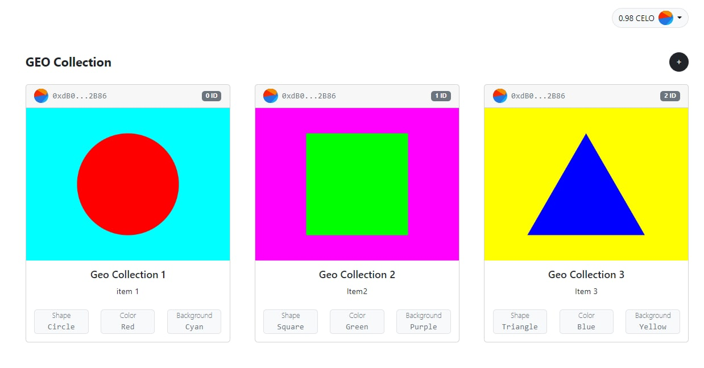

# Dacade Nft Marketplace

## Description

this was an educational project from [DACADE](https://dacade.org/) on building an NFT market place. see [here](https://dacade.org/communities/celo/courses/celo-201) for the course Connect.

## Technologies Used

- web3.storage
- celo webKit
- hardhat
- react

## TODO

-upload image and mint it as an NFT

## Live Demo

Checkout the Live Demo Of the Project Hear [Celo NFT project](https://celonftproject.netlify.app/)

## Usage

### Requirements

1. Install the Metamask wallet/ celo wallet
2. Create a wallet.
3. get some [Celo Faucet](https://celo.org/developers/faucet) and get tokens for the alfajores testnet.
4. Mint your NFT

